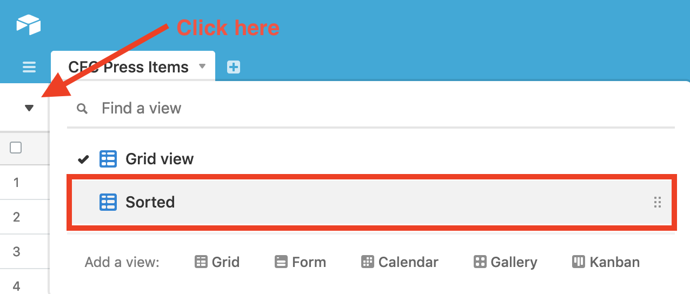

# cfc-press-file-generator
Pull data from AirTable and then format it into an HTML file used for our IBM Call for Code Press page.

Instead of filtering and searching for records with multiple statuses in Python, use AirTable "Views" to filter everything, call that view programmatically, and read the records.

This project uses the AirTable Python Wrapper - https://github.com/gtalarico/airtable-python-wrapper

# `Sorted` View
The program will pull everything from AirTable that shows in the `Sorted` View. This View is set to filter only by records that indicate `Show` in the `Visibility` column for that entry as well as sort by the most recent date so that the Press page shows the most recent items first.

# Adding Data
Add items to this AirTable - https://airtable.com/tblegjJ1br5Qgt7j9/viwYkTPn34G87Qg41?blocks=hide

# Item Visibility
To keep an item from appearing on the Press page, change that item to `Hide` in the `Visibility` column. The next time you run the program, you will see it is no longer in the HTML file.
